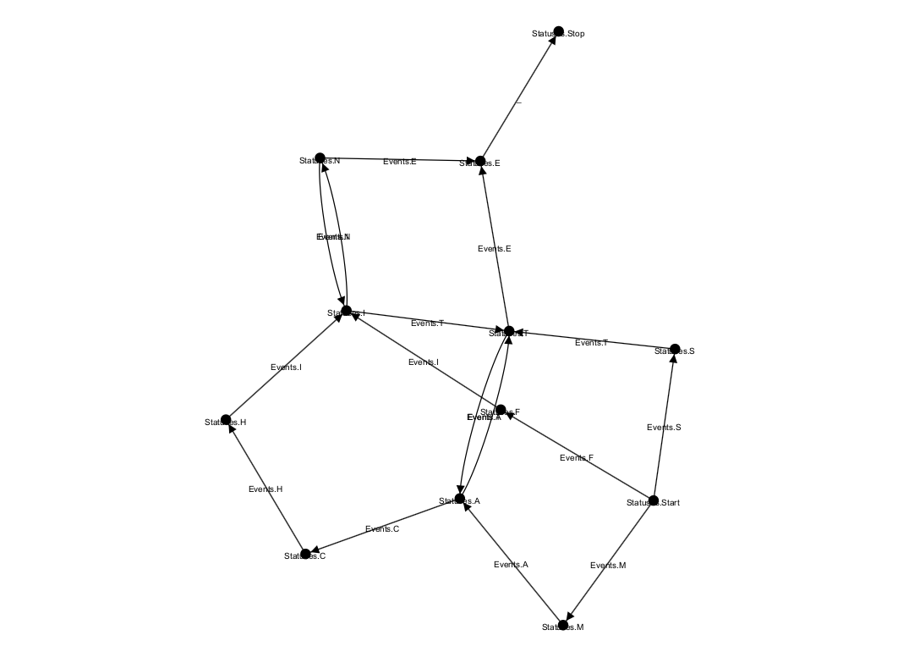
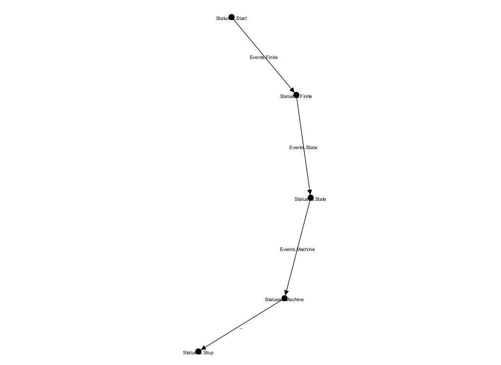

# FSMExample

Простая реализация конечного автомата с примером использования.

## Задача

Выявление последовательностей символов FINITESTATEMACHINE из входного потока данных с пропуском неподходящих символов.

### Пример входных данных

```
}%1VMF19C.:$A--+G-SWL5#>9XJ>TYNCU(EO'-5,2K~}?<2<3K\QX,!5FT.AX21IX^MYA9)I=+&LL{LO34K|DD~H|B2)KPLI5
\VFQOI-NLXK]*XYM[U&MMYS2U?S_2(3L%"J{)AEGGLK&V4GNMS_]U|;K<F_@B~J'Y"!YYB<YK?:8IW)}32JR<DXG)JAW~`'EI
L8S1\4%V'&/)TVCLL=;VY2_W>SVL&S5TOC;J*`>#7C/')!B&IS+HX|ZRG}V~T_W4FJ<33E8CTGOUV9Z?DEHJ'@D+>E!3RO2J^
MJ}?L{}IG~_IKWF>HHBZGKWVQUNJJ'QNNG*&N5GM;|S>X7CFZ!U1CZJMFYKPCF.CL6VLG+H1IW|ZYPBNN"AFSJJT,JV,IOSFE
K!}$25FAZCL\9?EJNKO>OW;YNSJUKMP+,SQ$OP#/Q%H4JIQ>K7<R@GUB-@GAK!42#1B6V*MOZV#Z<{YDI'AT<ZJ0LXTF{SM,\
{DW{\9]L{8@>|U/9P4/I6}[U43K\|T'_{W}^PND,/;CVFNK3+}6%5/PSC'A)X,PRN;A?M(2:TO'%6SEM}D6}1SWTOD]X\6QG8
DLZT,+N,XVGOG[BWOKJ^:UR,;IQCBH$RYQ.;TZ,IM!4GWYO8A&~R#2D<FFQ('XW^|G0;WC]#L3JUH,~C~&MYOOT$$~%V{X4VT
=&II`|GHXW$S'W$O(V&#-KOO9IS<RXQ}^PJEAS|I=Y0C$KQO9T[(2.`[G\(7CU{L.OJ[4$(-!S*S~7IF$B>UJ=S.DY30+)(]J
R/1!RZD[B1KS?X[FXTUF4Z<=Z#-X1BVC\{R6~].Z<K>^CKAGNVX*K[=.C?)WD+9W!WF|PF)I=Y`Y<RHZCR%2CROL-OGDV>X/S
OQU^O[R/P,=D-:N:O@|3RD._VJPC,[_E3`3.HL,NODKC}YS&&RNG"BBO[}LP}`CX:R`W%#BLGIG>J9^W8?.)NN/3C=)C'QK6K
MR(I~EBL/1L:J'?^.&OFNM(Z{"28FESG?V-\DRC$K6OK~A;X$SL8SV=E+O6$_VR;_$JZUPK`I&9Z3LVH~!!NW^H}'GFF(2(YS
DB`Y5D[`I2+_$LK*PPCAMLJP.V`AZGK9`~~CP8P!SQNOD#F~VX+[T.)@V`ZZYTNFVJVAJ{3AL[`!NJJ)Q=82%2SC)U3|ZPM^3
L?M_MY+D(OB<`HN,C7;EE^"2O7AFE+(WDO?!'UP+@QZ3#6G}C*0SS=C'C3HO+MTDU~`?4KU:DPBNF):F#;ZND1]3O1V8;KRZT
OOMB^TA-EZ1DF.G`E`O,JI?{WE>D.WWGR4H}9URG+L@SAL;<NT:{?JPN38PD+M\T_55`+;.FO"'ANKNU\BHYI?S-OBMLX<5%H
D62"J2:EQI?8_#:"Q$'CS8HP3-Y8GTO\E.Z[H*V=W%.!15L\(M|=SR;;91}PI_1D5%D<,/;GKQFE?AST;<D/JA7NF\`4UN=_U
+.X\}[Z,U"RZ&O1|7E7CQT?*AINZUBUGHQL%S:1P`]<DNY!5QKXQY=$S?'AZ%NUH>:^J#{EBPEIJ(7L%#^"WKRMGQ\A%$-BCZ
Q>V,\~PTRGMT9E,J,OXPSYG{_]\D<^L<VB4UOT*M7BL@H>;EZTEAQ*HX7K)YGCVQZ&'~L)Z7I*|*IQD"YJJDL]8AFUTAMO+",
J=;OAPAHD4W$VF^?LZ]EXRDZ\NSV@U|XR\2HQ_RRQKIUH91DWYI!;LG2U53`M\65DHO9:;{"]ZGQ+9_;I'F$ZWEQ<@ARO*VR*
GYTZ'I_5\2;QJF#*+^$SGH{2RO;DA#{F~:U#VW,{V!I]V$AEIG[IE[\*$+MY#D5X\B(E~"M|Q%91%LG&}{H)3Q],#{J/HV<:X
NGD(NF+OFW-MLCE(00I=Q)!B:CO(B$IJ:KU?PBQ9MZJ,7Z6CJ=/SYC>S8<9E.7Y#W6~]]VZ}|?(8X3D;*O+KP9L<;X!%3KHGX
.+0)SB~I8KSIJ@WT`G[XGP-3/-VB@C9%V{6UEAR9I@OIU5.:}F{K$H"8GHR>+'C&WB)UTR&6BE#(13}A+K5C?:NCQ8I4=C0N9
(^+''TU8H_,QE$<RZC]D3@XF[(XJCU/N@8CU&J%P@,~X8N;`0[{D^IKF8CS05ETLD)CT:1$,3FEZ:K}T<CO>,/L?II(H}GR>J
P8"WY(B%$5!`^4MU<NGRSS8|/$=PBH9K|XD5JN_YJ7PW6MWABELJ=KK>G|L"KYMUAX-(P*JA"N67EH:X&F"/<2W[RD_2_}6TP
```

## Реализация

Опишем нашу искомую последовательность в виде двух моделей.

Первая модель будет работать с символами и собирать из них слова.
Вторая модель будет работать со словами и собирать из них предложения.

### Описание первой модели

Модель будет начинаться с состояния Start и заканчиваться состоянием Stop.
Между этими состояниями будут состояния каждого символа.
Для удобства опишем весь английский алфавит.
Событиями переходов между состояниями будут символы искомых слов.
Также добавим событие Unknown для всех остальных неизвестных и неопределенных событий.

#### Графически это будет выглядеть следующим образом



Так как эта модель собирает последовательности всех трех искомых слов, то выход будет с небольшим шумом.

#### Пример выходных данных после первой модели

```
FINE
MACHINE
STE
STE
MACHITE
MACHITE
MATATATE
MACHINE
MATE
FITATACHITACHINITE
MACHINE
FITE
STE
STACHITE
FINE
MATE
STACHITE
MACHINITE
MATE
MACHITE
FITE
FITATE
MATACHITE
STE
FITATACHINITATE
STACHINE
MATE
FITATE
MACHINININE
MATATACHINININININE
MATE
FITACHITACHINE
STE
MACHITE
STATACHITATACHINITACHITATATACHINE
MACHITE
FINITE
```

### Описание второй модели

Модель будет начинаться с состояния Start и заканчиваться состоянием Stop.
Между этими состояниями будут состояния, отражающие каждое искомое слово.
Событиями переходов между состояниями будут искомые слова.
Также добавим событие Unknown для всех остальных неизвестных и неопределенных слов.

#### Графически это будет выглядеть следующим образом



Так как эта модель собирает последовательности всех трех искомых слов, то выход будет без какого-либо шума.

#### Пример выходных данных после второй модели

```
FINITESTATEMACHINE
FINITESTATEMACHINE
FINITESTATEMACHINE
FINITESTATEMACHINE
FINITESTATEMACHINE
FINITESTATEMACHINE
FINITESTATEMACHINE
FINITESTATEMACHINE
FINITESTATEMACHINE
FINITESTATEMACHINE
```

Как видим, вывод после второй модели нам дает требуемый результат.
